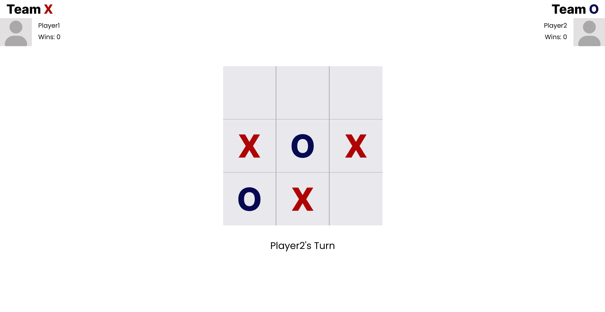

# Tic-Tak-Toe
This project is created as a part of [odin project curriculum](https://www.theodinproject.com/lessons/node-path-javascript-tic-tac-toe)

### Description
A two player online tic-tak-toe game.
Built with HTML, CSS, and vanilla JavaScript

## Learning
- how to seperate game logic with DOM
- how to use factory fuctions to buddle code together

[live-preview](https://akanksha493.github.io/Tic-Tak-Toe/)

## Screeshots

### Useful Resources
- [build a house from inside out by alex younger](https://www.ayweb.dev/blog/building-a-house-from-the-inside-out) : guide on how to build board games, how to seperate game logic from DOM, and how to use modules to group functionalities.

